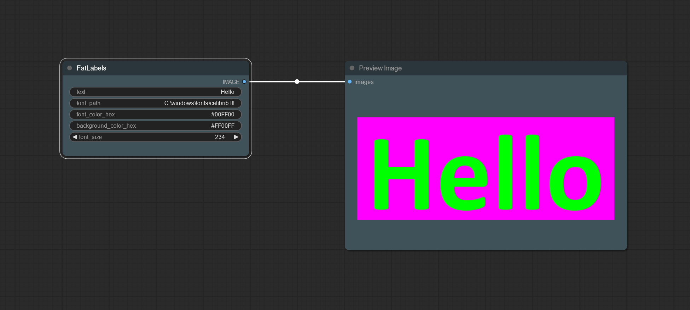

# ComfyUI Fat Labels

- Forked from: https://github.com/aianimation55/ComfyUI-FatLabels (Thank you @aianimation55 for making this 🙏)

### Howdy-Hey!

ComfyUI Fat Labels is a super simple custom node for Comfy UI, to generate text, with a font size option. 

This is a modified version that adds inputs for:
- The Font Path
- HEX values to change Text and Background colors
- (NEW) Now with kerning! (aka: line spacing)

#### How to Install

Install in the 'custom_nodes' folder in your ComfUI install.
